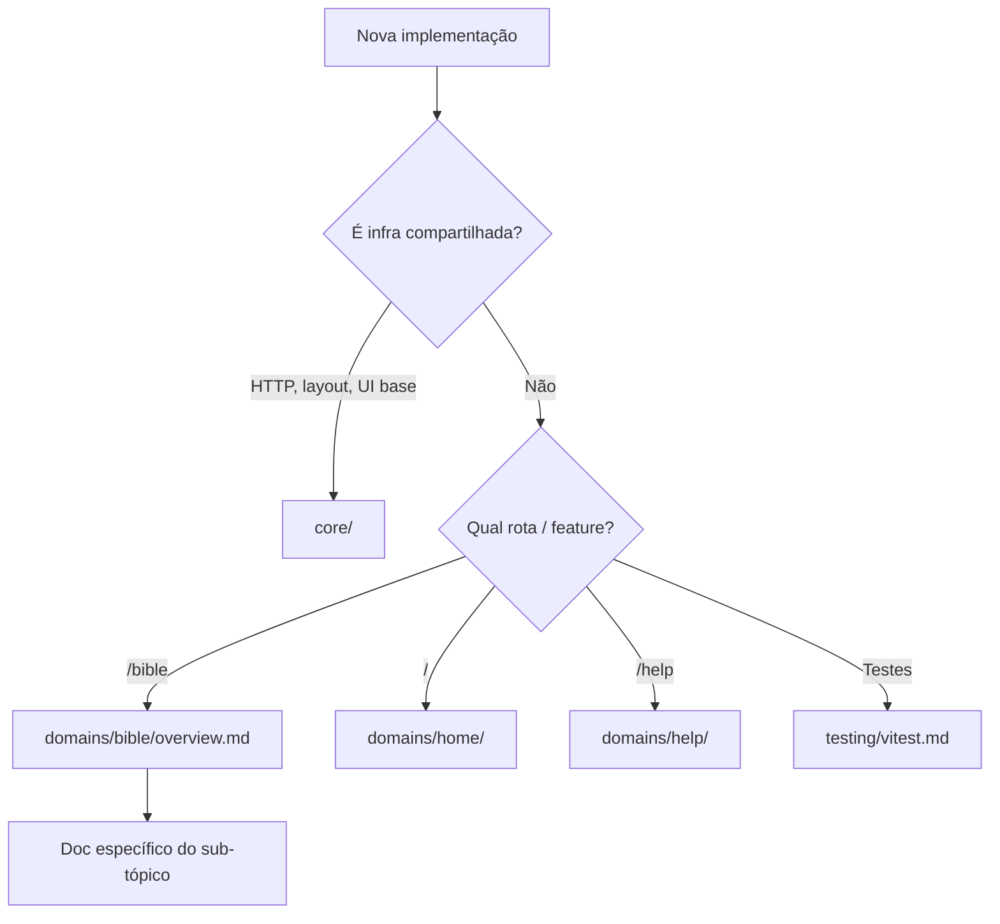

# Documentação técnica — Bibleasy Frontend

Guias sobre **como cada parte do projeto funciona**, organizados em duas camadas:

| Camada | Pasta | O que é |
|--------|-------|---------|
| **Core** | [`core/`](./core/) | Base compartilhada do app — HTTP, layout, UI, SEO, padrões de persistência. Vale para qualquer feature. |
| **Domínios** | [`domains/`](./domains/) | Features de produto isoladas por rota/responsabilidade — espelham `app/pages/` e `app/components/`. |
| **Testes** | [`testing/`](./testing/) | Vitest (unit / nuxt / e2e). |

> Convenções gerais, stack e Docker: [`AGENTS.md`](../AGENTS.md) e [`README.md`](../README.md).

## Core (`core/`)

| Documento | O que cobre |
|-----------|-------------|
| [HTTP layer](./core/http-layer.md) | Plugin `$api`, `useApiFetch`, `useApi`, services |
| [App shell](./core/app-shell.md) | Layout global, modais, SEO base, padrão de registro |
| [Persistence patterns](./core/persistence-patterns.md) | Pinia, cookies, localStorage — **como** persistir (regras genéricas) |
| [Routing overview](./core/routing-overview.md) | Mapa de rotas e responsabilidade de cada page |
| [SEO](./core/seo.md) | `useSeoMeta`, schema.org, sitemap Nitro |
| [Components and UI](./core/components-and-ui.md) | Pastas de componentes, ícones, temas, DaisyUI/PrimeVue |

## Domínios (`domains/`)

### Bible (`domains/bible/`)

Leitura da Bíblia — maior domínio do app. Inclui bootstrap de catálogo (versões/livros) acoplado ao layout hoje.

| Documento | O que cobre |
|-----------|-------------|
| [Overview](./domains/bible/overview.md) | Fronteiras do domínio, mapa de pastas, acoplamentos |
| [URLs and references](./domains/bible/urls-and-references.md) | Formato de URL, parsing, navegação, hash `#vN` |
| [Chapter reader](./domains/bible/chapter-reader.md) | Page `/bible/[reference]`, `BibleChapter`, SEO do capítulo |
| [Verses and placeholders](./domains/bible/verses-and-placeholders.md) | Seleção, cópia, highlights, referências cruzadas |
| [Search and selector](./domains/bible/search-and-selector.md) | `SearchModal`, seletor lateral, atalho de teclado |
| [Catalog and metadata](./domains/bible/catalog-and-metadata.md) | `book.ts`, stores de versão, bootstrap de livros |
| [Reading history](./domains/bible/reading-history.md) | Histórico local, último capítulo |

### Home (`domains/home/`)

| Documento | O que cobre |
|-----------|-------------|
| [Landing page](./domains/home/landing-page.md) | `/`, seções marketing, versículo do dia |

### Help (`domains/help/`)

| Documento | O que cobre |
|-----------|-------------|
| [Help center](./domains/help/help-center.md) | `/help`, FAQ, suporte, modal global |

## Testes (`testing/`)

| Documento | O que cobre |
|-----------|-------------|
| [Vitest projects](./testing/vitest.md) | unit / nuxt / e2e, espelhamento de `app/` |

## Onde começar

## Princípios transversais

1. **Core vs domínio** — HTTP, layout e padrões de UI ficam em `core/`; regras de negócio da Bíblia ficam em `domains/bible/`.
2. **SSR primeiro** — GETs declarativos via `useApiFetch` quando a page participa do render no servidor.
3. **Tipos via Zod** — `app/types/<entidade>/`; inferir tipos, não duplicar interfaces.
4. **pt-BR na UI** — strings visíveis e meta em português; comentários de código em inglês.
5. **Espelhar o vizinho** — mesma pasta em `app/` que a feature que você está implementando.

## Acoplamento atual (importante)

O **layout global** carrega versões e livros da API antes de qualquer page — dados do domínio Bible, mas disponíveis em `/`, `/help` e `/bible`. Home usa `lastChapterUrl`; o header expõe busca bíblica. Detalhes e fronteiras: [Bible domain overview](./domains/bible/overview.md).
