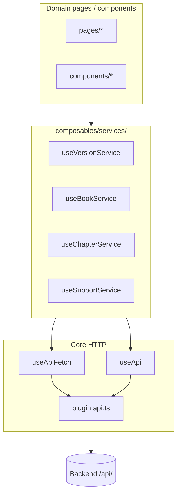

# HTTP layer

Infraestrutura HTTP compartilhada por **todos os domínios**. O frontend consome o REST API do [bibleasy-backend](https://github.com/viniciusrvcruz/bibleasy-backend).

## Arquitetura



Services vivem em `composables/services/` — **não** dentro de `composables/bible/`. Domínios consomem services; services não conhecem UI.

## Plugin `$api`

Arquivo: `app/plugins/api.ts`

| Aspecto | Servidor (SSR) | Cliente |
|---------|----------------|---------|
| Base URL | `runtimeConfig.apiBaseUrl` | `runtimeConfig.public.apiBaseUrl` |
| Prefixo | `{baseURL}/api/` | idem |
| `X-Api-Key` | Sim | **Não** |
| Content-Type | JSON (exceto `FormData`) | idem |

Nunca exponha `NUXT_API_KEY` no client.

## `useApiFetch` — GETs com SSR

Arquivo: `app/composables/useApiFetch.ts`

```ts
useFetch(url, { key: url, $fetch: useNuxtApp().$api, ...options })
```

Use em pages/services quando o dado deve ser buscado no servidor e deduplicado por URL.

## `useApi` — chamadas imperativas

Arquivo: `app/composables/useApi.ts` — `get`, `post`, `put`, `del`.

Use para mutações, lazy load ou pós-interação (ex.: troca de versão, submit de formulário).

## Services por domínio

| Service | Domínio | Endpoint |
|---------|---------|----------|
| `useVersionService` | Bible (catálogo) | `GET versions` |
| `useBookService` | Bible (catálogo) | `GET versions/{id}/books` |
| `useChapterService` | Bible (leitor) | `GET .../chapters/{n}` |
| `useVerseHighlightService` | Bible (client) | localStorage — sem API |
| `useSupportService` | Help | `POST support` (FormData) |

Detalhes dos endpoints bíblicos: [Catalog and metadata](../domains/bible/catalog-and-metadata.md).

## Adicionar um resource novo

1. Schema Zod em `app/types/<entity>/`.
2. `useXService.ts` em `composables/services/`.
3. GETs SSR → `useApiFetch`; mutações → `useApi()`.
4. Consumir na page ou composable do **domínio** — não chamar `$fetch` direto.

## Erros

- `createAppError()` (`app/utils/errors.ts`) — falhas user-facing; `fatal` no client.
- Bootstrap sem dados: layout lança erro cedo ([App shell](./app-shell.md)).
- Capítulo ausente: page trata `null` com UI — ver [Chapter reader](../domains/bible/chapter-reader.md).

## Variáveis de ambiente

| Variável | Uso |
|----------|-----|
| `NUXT_PUBLIC_API_BASE_URL` | Browser |
| `NUXT_API_BASE_URL` | SSR / Docker |
| `NUXT_API_KEY` | Server only |

Validação: `app/utils/env.ts` → `nuxt.config.ts`.
