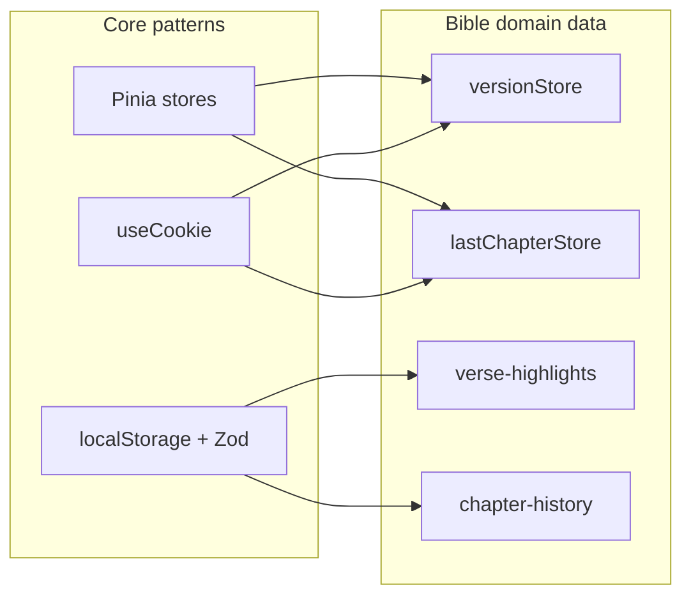

# Persistence patterns

Regras **genéricas** para estado e armazenamento. Dados concretos de cada domínio ficam nos docs do domínio.

## Três mecanismos

| Mecanismo | Quando usar | SSR-safe? |
|-----------|-------------|-----------|
| **Pinia** | Estado reativo compartilhado na sessão | Sim (com hidratação) |
| **Cookie** (`useCookie`) | Preferências que sobrevivem reload; opcionalmente SSR | Sim |
| **localStorage** | Dados só client, volume maior | **Não** — guard `import.meta.client` |

## Pinia

- Arquivo: `stores/<name>Store.ts`, id curto (`'version'`).
- Export: `useXStore()` — auto-import Nuxt.
- Mutations explícitas (`setVersions`, `setLastChapter`); evite mutar refs de fora.
- Stores atuais e **qual domínio** os dona:

| Store | Domínio | Doc |
|-------|---------|-----|
| `versionStore` | Bible | [Catalog and metadata](../domains/bible/catalog-and-metadata.md) |
| `lastChapterStore` | Bible | [Reading history](../domains/bible/reading-history.md) |

## Cookies

Padrão no projeto:

```ts
useCookie<string | null>('cookie-name', { maxAge: 60 * 60 * 24 * 365 })
```

| Cookie | Domínio | Definido em |
|--------|---------|-------------|
| `current-version-name` | Bible | `versionStore` |
| `last-chapter-reference` | Bible | `lastChapterStore` |
| `bible-font-size`, `bible-font-family` | Bible | `BibleChapter` |
| `theme` | Core | `@nuxtjs/color-mode` |

## localStorage

Padrão obrigatório:

1. Schema Zod em `app/types/`.
2. Service ou composable encapsula read/write.
3. `if (!import.meta.client) return` em escritas.
4. JSON inválido → remover chave, retornar vazio.

Exemplos no domínio Bible: [Verses and placeholders](../domains/bible/verses-and-placeholders.md), [Reading history](../domains/bible/reading-history.md).

## Onde persistir feature nova

| Tipo de dado | Escolha |
|--------------|---------|
| UI efêmera (modal aberto, seleção temporária) | `ref` local no componente |
| Preferência global simples | Cookie |
| Estado compartilhado entre rotas | Pinia (+ cookie se precisar sobreviver reload) |
| Anotações só client | localStorage + Zod |
| Sync entre dispositivos | Backend (ainda não usado para highlights) |

## Estado que **não** vai para store global

Exemplos Bible (detalhes nos docs do domínio):

- Versículos selecionados — local ao `BibleChapter`, reset no remount.
- Foco de versículo — derivado do hash da URL.
- Query do SearchModal — refs locais.

## Diagrama


