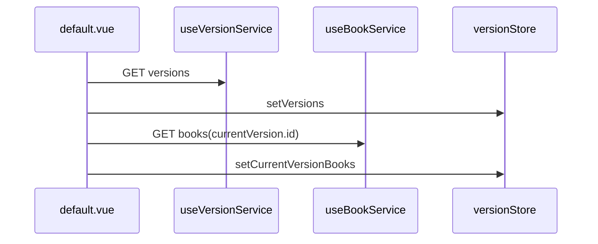

# Catalog and metadata

Catálogo de versões/livros, metadados estáticos e bootstrap de dados bíblicos.

## Metadados estáticos — `book.ts`

`app/utils/bible/book.ts` — array `BOOKS`:

```ts
['gen', 'Gênesis', 50],  // [abbr, nome pt-BR, qtd capítulos estática]
```

| Export | Uso |
|--------|-----|
| `BookAbbreviation` / `BookAbbreviationType` | Enums Zod, rotas |
| `getBookAbbreviation(key)` | Parse de URL |
| `getDefaultBookName`, `getDefaultBookChapterCount` | Fallbacks estáticos |

### Estático vs API

| Cenário | Fonte |
|---------|-------|
| URLs, sitemap, validação de rota | `book.ts` |
| Nome do livro na versão atual, capítulos disponíveis | API → `versionStore.currentVersionBooks` |
| Capítulo existe? | API → null → `ChapterNotFound` |

## `versionStore`

`app/stores/versionStore.ts` — Pinia global, **dados Bible**.

| Estado | Descrição |
|--------|-----------|
| `versions` | Todas as versões (API) |
| `currentVersion` | Versão ativa + cookie `current-version-name` |
| `currentVersionBooks` | Livros e capítulos da versão |
| `allChapters` | Flat list — nav prev/next no leitor |

Resolução da versão inicial (`setVersions`):

1. Cookie `current-version-name`
2. `NUXT_PUBLIC_DEFAULT_VERSION_ABBREVIATION`
3. Primeira versão da API

Mutators: `setCurrentVersion`, `setCurrentVersionBooks`, `setCurrentVersionWithBooks`.

## Bootstrap no layout



Sem backend → `createAppError`. Acoplamento com plataforma: [Bible overview](./overview.md).

### Versão diferente na URL

Page `[reference]` detecta mismatch, chama `bookService.useIndex(version.id, false)` e `setCurrentVersionWithBooks`.

## Services de catálogo

| Service | Método | Endpoint |
|---------|--------|----------|
| `useVersionService` | `useIndex()` | `GET versions` |
| `useBookService` | `useIndex(id)`, `index(id)` | `GET versions/{id}/books` |
| `useChapterService` | `useShow(...)` | capítulo completo — [Chapter reader](./chapter-reader.md) |

HTTP patterns: [HTTP layer](../../core/http-layer.md).

## Sitemap — entradas de capítulo

`app/utils/bible/sitemapUrls.ts` — `buildSitemapEntries()`:

- `/`, `/help` (fixas)
- `/bible/{abbr}.{chapter}` para cada livro × capítulo em `BOOKS`

Sem versão na URL do sitemap. Nitro: `server/api/__sitemap__/urls.ts`.

SEO geral: [SEO](../../core/seo.md). Testes: `test/unit/utils/bible/sitemapUrls.test.ts`.

## Checklist: novo livro

1. `BOOKS` em `book.ts`
2. Schemas Zod com `z.enum(BookAbbreviation)`
3. Rodar testes `book.test.ts`, `sitemapUrls.test.ts`
4. Alinhar abreviação com backend
