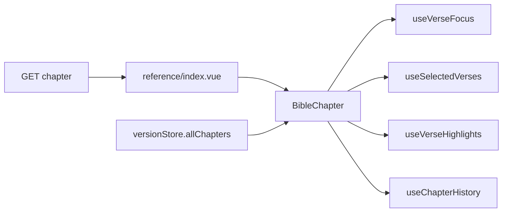

# Chapter reader

Fluxo da rota `/bible/[reference]` e componente `BibleChapter`.

## Page — `pages/bible/[reference]/index.vue`

1. Parse — [urls-and-references.md](./urls-and-references.md)
2. Sync versão URL ↔ `versionStore` — [catalog-and-metadata.md](./catalog-and-metadata.md)
3. Fetch — `useChapterService().useShow`
4. `lastChapterStore.setLastChapter` — [reading-history.md](./reading-history.md)
5. SEO dinâmico (`useSeoMeta`, `useSchemaOrg`)
6. Template: seletor + `BibleChapter` ou `ChapterNotFound`

| Condição | UI |
|----------|-----|
| `chapterData` ok | `BibleChapter` |
| `chapterData` null | `BibleChapterNotFound` |
| Troca de rota | `isLoading` + blur |

### SEO do capítulo

- Title: `{Livro} {Cap} | {Versão}`
- Schema: `WebPage` + `Article`, `inLanguage: 'pt-BR'`

## Componente `BibleChapter`

`app/components/bible/chapter/index.vue` → `<BibleChapter>`

### Props

```ts
{ chapter: Chapter, isLoading: boolean }
```

### Subcomponentes

| Componente | Papel |
|------------|-------|
| `BibleChapterHeader` | Título, versão, fonte |
| `BibleChapterVerse` | Versículo (seleção, highlight, foco) |
| `BibleChapterTitle` | Títulos start/end |
| `BibleChapterFooter` | Rodapé |
| `BibleSelectedVerses` | Painel de seleção |
| `BibleVerseSelectorResponsivePanel` | Nav livro/cap — [search-and-selector.md](./search-and-selector.md) |

### Prev / next

`versionStore.allChapters` → índice → `getChapterUrl()` sem versão.

### Preferências (cookies)

| Cookie | Default |
|--------|---------|
| `bible-font-size` | `text-lg` |
| `bible-font-family` | `font-sans` |

### Troca de versão in-page

`handleVersionSelect`: set version → `bookService.index` → reload books → `goToChapter` (mesmo livro/cap/verse).

### Fullscreen

`useBibleFullscreen` — page aplica `fixed inset-0 z-50` no `<main>`.

## Tipos

`app/types/chapter/Chapter.schema.ts` — `verses[]` com `titles`, `references` → [verses-and-placeholders.md](./verses-and-placeholders.md).

## Fluxo de dados



## Implementar no leitor

- Header → `ChapterHeader.vue`
- Ação por versículo → `Verse.vue` + composable
- Campo API novo → schemas Zod primeiro
- Highlights keyed por `chapterKey`; seleção reseta no remount
