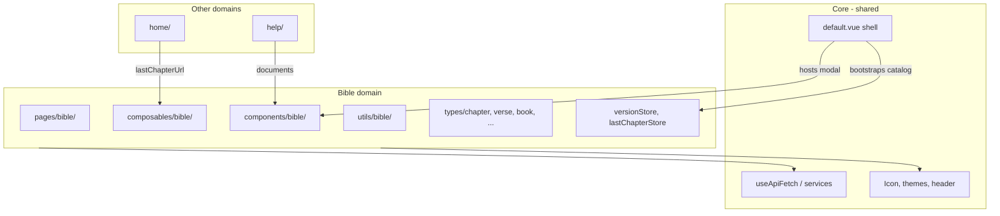

# Bible domain — overview

O domínio **Bible** cobre leitura, navegação entre livros/capítulos/versículos, catálogo de versões e features client-side do leitor (highlights, histórico).

## Fronteira do domínio

## Mapa de código

| Área | Caminho | Responsabilidade |
|------|---------|------------------|
| Rotas | `app/pages/bible/` | Redirect `/bible`, leitor `[reference]` |
| Composables | `app/composables/bible/` | Referências, versículos, histórico, fullscreen |
| Navegação shared | `app/composables/useNavigateToBible.ts` | URLs e `navigateTo` — usado também por Home |
| Services | `app/composables/services/use*Service.ts` | API REST (version, book, chapter, highlight) |
| Componentes | `app/components/bible/` | Leitor, busca, seletor, seleção |
| Metadados estáticos | `app/utils/bible/` | `book.ts`, placeholders, sitemap entries |
| Stores | `app/stores/versionStore.ts`, `lastChapterStore.ts` | Catálogo + preferências de leitura |
| Tipos | `app/types/book`, `chapter`, `verse`, … | Schemas Zod da API bíblica |

## Sub-documentos

| Tópico | Doc |
|--------|-----|
| URLs, parsing, hash | [urls-and-references.md](./urls-and-references.md) |
| Page e componente do capítulo | [chapter-reader.md](./chapter-reader.md) |
| Texto, seleção, highlights | [verses-and-placeholders.md](./verses-and-placeholders.md) |
| Busca e seletor | [search-and-selector.md](./search-and-selector.md) |
| Livros, versões, bootstrap | [catalog-and-metadata.md](./catalog-and-metadata.md) |
| Histórico e último capítulo | [reading-history.md](./reading-history.md) |

## Acoplamento com a plataforma

### Bootstrap no layout (decisão atual)

`layouts/default.vue` chama `useVersionService` e `useBookService` **antes** do `<slot />`. Isso significa:

- `/`, `/help` e `/bible` só renderizam com backend + catálogo válido.
- `versionStore.currentVersion` e `currentVersionBooks` existem em qualquer page.
- Home e header podem usar versão/último capítulo sem fetch extra.

**Se precisar desacoplar no futuro:** mover bootstrap para middleware ou layout aninhado só em `/bible/**`, e tornar catálogo lazy na home/help.

### Modais globais bíblicos

`BibleSearchModal` vive no layout ([App shell](../../core/app-shell.md)) porque a busca rápida (teclado) deve funcionar em qualquer rota. A **lógica** do modal é domínio Bible — ver [search-and-selector.md](./search-and-selector.md).

### Stores “globais” com dados bíblicos

`versionStore` e `lastChapterStore` são Pinia app-wide, mas o **conteúdo** é do domínio Bible. Outros domínios devem apenas **consumir** (ex.: link para último capítulo), não estender essas stores com campos de help/home.

## Adicionar feature no domínio Bible

1. Ler o sub-doc mais próximo (tabela acima).
2. Colocar UI em `components/bible/`, lógica em `composables/bible/`.
3. Novo endpoint → service em `composables/services/` + schema em `types/`.
4. Nova abreviação de livro → `utils/bible/book.ts` + [catalog-and-metadata.md](./catalog-and-metadata.md).
5. Testes em `test/unit/utils/bible/` ou `test/nuxt/` espelhando `app/`.

## Fora deste domínio

| Feature | Domínio / doc |
|---------|----------------|
| Landing, CTA, stats | [Home](../home/landing-page.md) |
| FAQ, formulário suporte | [Help](../help/help-center.md) |
| HTTP, `$api` | [HTTP layer](../../core/http-layer.md) |
| Temas, header chrome | [Components and UI](../../core/components-and-ui.md) |
