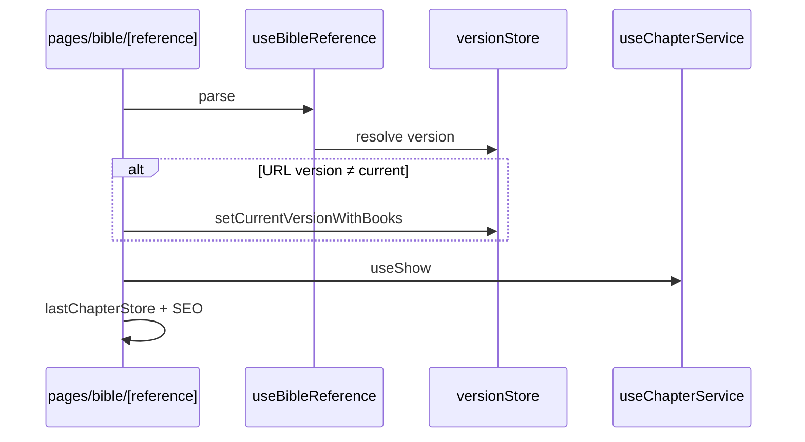

# URLs and references

Formato de URL, parsing e navegação programática do domínio Bible.

## Formato

```
/bible/{book}.{chapter}[.{version}][#v{number}]
```

| Segmento | Exemplo | Obrigatório | Descrição |
|----------|---------|-------------|-----------|
| `book` | `gn`, `jhn`, `1co` | Sim | Abreviação em `app/utils/bible/book.ts` |
| `chapter` | `1`, `150` | Sim | Número inteiro |
| `version` | `acf`, `nvi` | Não | Omitida = versão atual (`versionStore`) |
| `#vN` | `#v16` | Não | Foco no versículo N (N > 1) |

**Exemplos:** `/bible/jhn.3` · `/bible/jhn.3.acf` · `/bible/psa.23.nvi#v4`

## Parsing — `useBibleReference`

`app/composables/bible/useBibleReference.ts`

```ts
const [bookParam, chapterParam, versionNameParam] = reference.split('.')
```

1. Livro via `getBookAbbreviation()` — inválido → fallback **`jhn`**
2. Capítulo: `Number(chapterParam) || 1`
3. Versão: param URL ou `versionStore.currentVersion`
4. Sem versão → `createAppError('A versão não foi encontrada')`

## Navegação — `useNavigateToBible`

`app/composables/useNavigateToBible.ts` (fora de `composables/bible/` porque Home também usa)

| API | Uso |
|-----|-----|
| `getChapterUrl(book, chapter, version?, verse?)` | Monta path + hash |
| `goToChapter(...)` | `navigateTo` |
| `goToLastChapter(replace?)` | Cookie ou João 1 |
| `lastChapterUrl` | Link na home/header |

Nav interna (prev/next) **omite** versão na URL — usuário permanece na versão do store/cookie.

## Fluxo ao mudar capítulo



## Hash `#vN`

- Lido em `BibleChapter` → `useVerseFocus`
- Scroll suave + overlay; v1 ou capítulo curto → sem overlay
- Limpar foco → `history.replaceState` remove hash

Detalhes de render: [Verses and placeholders](./verses-and-placeholders.md).

## Rotas Bible

| Rota | Arquivo |
|------|---------|
| `/bible` | `pages/bible/index.vue` — só `goToLastChapter(true)` |
| `/bible/[reference]` | `pages/bible/[reference]/index.vue` |

Mapa geral: [Routing overview](../../core/routing-overview.md).

## Ao mudar URLs

1. `useNavigateToBible` / `useBibleReference`
2. `utils/bible/sitemapUrls.ts` + [Catalog and metadata](./catalog-and-metadata.md)
3. Testes unit em `test/unit/utils/bible/`
4. Buscar `/bible/` em copy e SEO
