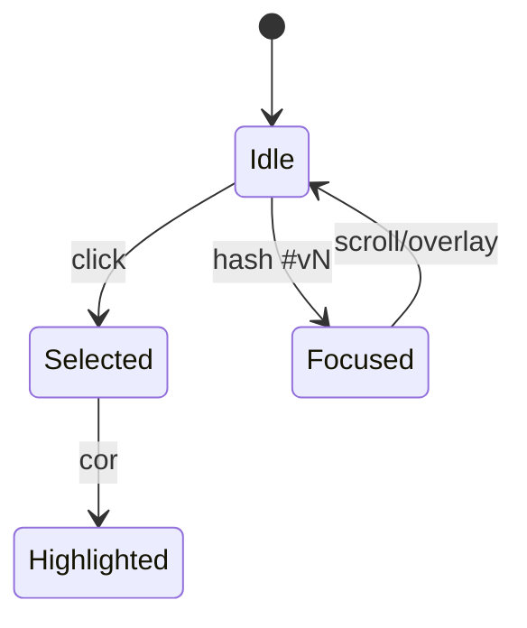

# Verses and placeholders

Renderização, seleção, cópia e highlights de versículos.

## Placeholders no texto

| Marcador | Significado |
|----------|-------------|
| `{{slug}}` | Referência cruzada |
| `[[slug]]` | Título inline |

Fonte: `app/utils/bible/versePlaceholders.ts`

### `useProcessedVerseParts`

`app/composables/bible/useProcessedVerseParts.ts` → partes `text` | `reference` | `title`.

Usado em `Verse.vue`, `Title.vue`.

### Títulos de seção

`Verse.titles[]` com `position: 'start' | 'end'` → `BibleChapterTitle`.

### Cópia plain text

`stripVersePlaceholders()` antes do clipboard.

## Seleção — `useSelectedVerses`

| API | Descrição |
|-----|-----------|
| `toggleVerse(n)` | Toggle seleção |
| `hasSelection` | Painel `BibleSelectedVerses` |
| `formattedReference(book, chapter)` | Ex.: `João 3:16-18` |
| `copySelectedVerses(params)` | Texto + ref + URL |

`formatVerseReference([1,2,3,5])` → `"1-3,5"` — testes em `test/unit/`.

## Highlights

- Service: `useVerseHighlightService` (localStorage)
- Composable: `useVerseHighlights(chapterKey, selectedVerses)`
- Chave: `{book}.{chapter}.{version}` uppercase — ex. `JHN.3.ACF`
- Schema: `verseHighlightsStorageSchema`

Persistência: [Persistence patterns](../../core/persistence-patterns.md).

## Foco — hash `#vN`

`useVerseFocus` + `id="v{n}"` em `Verse.vue`. Ver [urls-and-references.md](./urls-and-references.md).

## Referências cruzadas

`VerseReference.vue` + tipo `VerseReference` → navega com `useNavigateToBible`.

## Diagrama

## Onde mexer

| Feature | Arquivos |
|---------|----------|
| Novo placeholder | `versePlaceholders.ts`, `useProcessedVerseParts` |
| Painel seleção | `SelectedVerses.vue`, `useSelectedVerses` |
| Highlight | `useVerseHighlightService`, UI de cores |
| Tooltip ref | `VerseReference.vue` |
