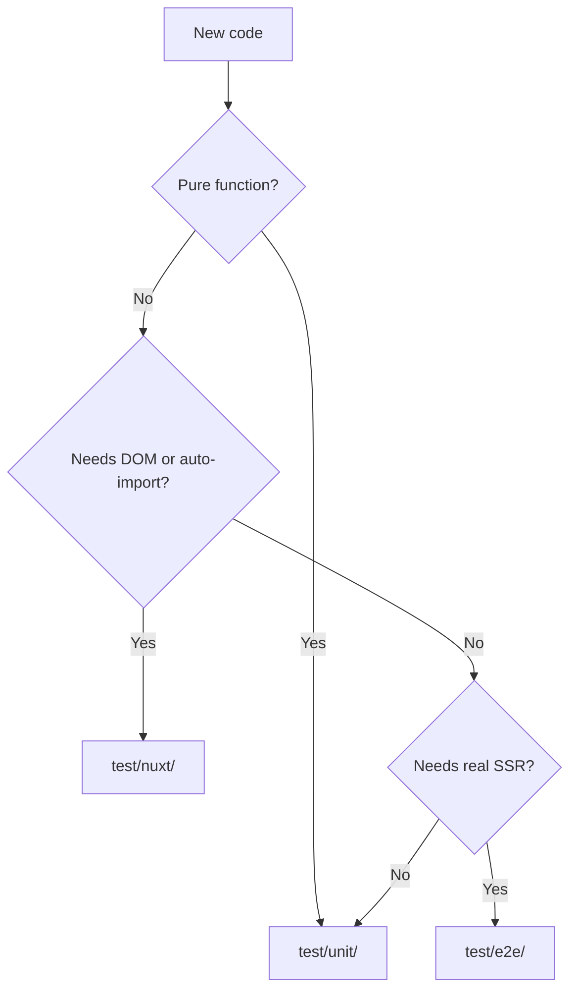

# Testing with Vitest

Cross-cutting test infrastructure. Domain-specific test examples are noted per area in [`docs/domains/`](../domains/) and [`docs/core/`](../core/).

Three **projects** in `vitest.config.ts`, aligned with [Nuxt Testing docs](https://nuxt.com/docs/getting-started/testing).

## Projects

| Project | Directory | Environment | When to use |
|---------|-----------|-------------|-------------|
| `unit` | `test/unit/` | Node | Pure functions, schemas, metadata — **no** Nuxt runtime |
| `nuxt` | `test/nuxt/` | Nuxt + happy-dom | DOM composables, components, auto-imports |
| `e2e` | `test/e2e/` | Node + Nuxt server | Full SSR, Nitro routes — **slow** (~45s+ setup) |

## Commands

```bash
npm test              # all projects
npm run test:unit     # fast — prefer during development
npm run test:nuxt
npm run test:e2e
npm run test:watch
```

In Docker (preferred):

```bash
docker compose exec bible_frontend npm test
```

## Mirroring `app/`

Test paths mirror source:

```
app/utils/bible/book.ts          → test/unit/utils/bible/book.test.ts
app/utils/helpers.ts             → test/unit/utils/helpers.test.ts
app/utils/bible/sitemapUrls.ts   → test/unit/utils/bible/sitemapUrls.test.ts
```

## `~/` alias

Configured in `vitest.config.ts` pointing to `./app`:

```ts
import { formatVerseReference } from '~/composables/bible/useSelectedVerses'
```

Works in **unit** and **nuxt**; unit **does not** have Nuxt auto-imports (`useRoute`, etc.).

## Test environment

File: `.env.test` (committed — fake values only).

Loaded automatically by Vitest. CI may override via secrets.

## Best practices by type

### Unit (`test/unit/`)

**Good for:**

- `formatVerseReference`, `getBookAbbreviation`, `buildSitemapEntries`
- Zod parsing of JSON fixtures
- Helpers in `app/utils/`

**Avoid:** `mount`, `useFetch`, anything needing Pinia/Nuxt context.

### Nuxt (`test/nuxt/`)

**Good for:**

- Vue components with auto-imports
- Composables using `useRoute`, cookies, etc.

**Helpers:**

```ts
import { mountSuspended, mockNuxtImport, registerEndpoint } from '@nuxt/test-utils/runtime'
```

- `mountSuspended` — mount with Nuxt context
- `mockNuxtImport('useVersionStore', () => ...)` — mock stores
- `registerEndpoint('/api/...', () => mockData)` — mock Nitro API

**Rule:** do not mix `@nuxt/test-utils/runtime` and `@nuxt/test-utils/e2e` in the same file.

### E2E (`test/e2e/`)

**Good for:**

- Verifying real page SSR
- Nitro routes end-to-end

**Caution:** pages using `layouts/default.vue` need a backend or mocks for all bootstrap endpoints.

**Prefer unit** for `server/api/__sitemap__/urls.ts` logic — extracted to `app/utils/bible/sitemapUrls.ts` for that reason.

## CI

`.github/workflows/ci.yml`:

1. `npx nuxt typecheck`
2. `npm test`
3. `npm run build`

## Adding tests for a new feature



1. Write tests in the cheapest project possible.
2. Name `*.test.ts` or `*.spec.ts`.
3. Keep fixtures small and inline, or colocate if large.
4. Do not test trivial implementation (obvious getters, re-exports).

## Existing examples

| File | Validates |
|------|-----------|
| `test/unit/utils/bible/book.test.ts` | Book metadata |
| `test/unit/utils/bible/sitemapUrls.test.ts` | URL count and format |
| `test/unit/formatVerseReference.test.ts` | Verse range grouping |
| `test/nuxt/utils/helpers.test.ts` | Helpers with Nuxt context |

## Troubleshooting

| Problem | Solution |
|---------|----------|
| `useX is not defined` in unit | Move to nuxt or import explicitly |
| Fetch fails in e2e | Mock endpoints or start backend |
| Slow test | Move logic to `utils/` and test in unit |
| Env missing | Check `.env.test` and `vitest.config.ts` |
